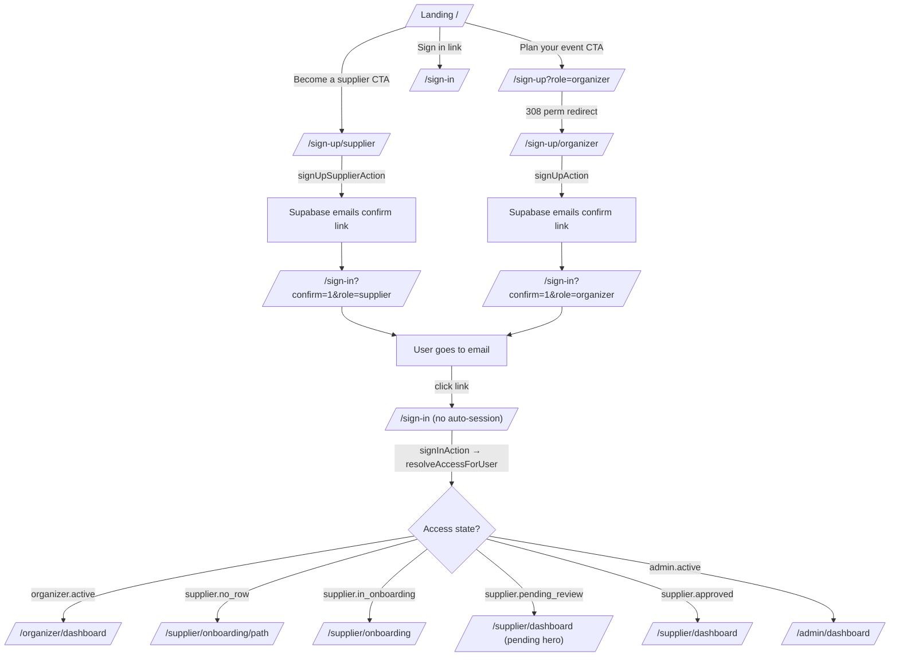
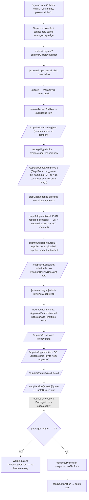
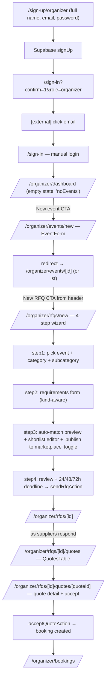

# Sevent — UX/Workflow Analysis

**Author:** UX Research pass
**Date:** 2026-04-23
**Method:** Static analysis of Next.js App Router source under `D:\Mufeed\Sevent\Code\src`. Dev server was not exercised in browser; findings are grounded in code inspection with file:line citations.
**Scope:** auth entry, post-signup routing, supplier full path, organizer full path, cross-cutting concerns (role confusion, nav, i18n, public browsing, empty/error states).

---

## 1. Executive summary

Overall verdict per role:

- **Organizer:** Mostly logical. The funnel from landing CTA → sign-up → email confirm → dashboard → "New event" → "New RFQ" → quotes table → accept is coherent and well-stepped, with one significant friction point (mandatory email confirmation with no in-app guidance afterwards) and one structural gap (no organizer onboarding/welcome — they land on an empty dashboard with no inline tutorial). Coherence: 4/5. Friction: 2/5.
- **Supplier:** Largely coherent but heavy. The path is `landing → sign-up/supplier (3 fields) → email confirm → sign-in → /supplier/onboarding/path → 3-step wizard → pending review → (admin approval, async) → approved dashboard → opportunities/RFQs → quote builder`. Steps are well-labeled and the wizard has a live preview, but there are multiple sub-issues: (a) the path picker lies about "Resume — step 1 of 3" on a brand-new user (`PathClient.tsx:67`), (b) terminal "pending" state has no ETA and the mailto: link is the only support channel (`PendingReviewChecklist.tsx:124`), and (c) the quote builder requires the supplier to have created Packages first or it shows a warning alert with no link to the catalog (`quote/page.tsx:297-303`). Coherence: 3.5/5. Friction: 3.5/5.
- **Admin:** Out of scope, but TopNav exposes Dashboard + Verifications only — no link from the supplier verifications queue to a "first-time admin" tour (not analyzed here).

### Top 5 issues, ranked by severity

1. **P0 — No password reset / forgot-password flow exists.** Grep across `src/` for `password.{0,30}reset|forgot.{0,30}password|recover` returns zero auth-related files. A user who forgets their password is locked out with no in-app recovery. This is a launch-blocker. Email confirmation links exist (`actions.ts:68`) but only point to `/sign-in` — there is no companion recovery flow.
2. **P0 — Role lock-in is total and silent.** The Supabase auth signup writes `role` into `raw_user_meta_data` (`actions.ts:67`, `actions.ts:113`). There is no UI anywhere to switch role, see "I am also a supplier", or merge a second role into the same account. A user who picks the wrong role on the landing page must contact support or create a second account with a different email. There is also no warning at sign-up that the choice is permanent.
3. **P1 — Email confirmation handoff is broken in spirit.** `signUpAction` and `signUpSupplierAction` (`actions.ts:74, 137`) both `redirect("/sign-in?confirm=1&...")`. The user is sent to the sign-in form with a single banner — but they cannot sign in until they click the email link. Banner copy `auth.signIn.confirmBanner` is the *only* signal. There is no "didn't get the email? resend" affordance, and clicking the email link drops them back at `/sign-in` (per `emailRedirectTo`) with no auto-login or success feedback. For a marketplace where suppliers are about to upload commercial documents, this is a real abandonment risk.
4. **P1 — Supplier path picker shows fake progress on first run.** `PathClient.tsx:65-72` always renders a `ResumeCard` with `percent={8}, step={1}, totalSteps={3}` — even for a user who literally just signed up and hasn't submitted anything. The card's "Resume" CTA does the same thing as the main "Continue" button. This is confusing (what am I resuming?) and dishonest (8% of what?). Resume UI should only render when there is real saved progress (i.e., a `suppliers` row already exists with `legal_type`).
5. **P1 — Pending-review state is a black hole.** After completing onboarding the supplier lands at `/supplier/dashboard?submitted=1` (`wizard.tsx:342`), which renders `PendingReviewChecklist` with a spinner and the copy "We've received your application … we'll email you" (`PendingReviewChecklist.tsx:107-115`). There is no SLA, no expected review window, no "currently reviewing X applications", and the only support channel is a `mailto:verification@sevent.sa` link (`PendingReviewChecklist.tsx:124`) that opens a desktop mail client. Suppliers will refresh, ask "is something broken?", and churn. The TopNav also still shows "Onboarding" as an active link (`TopNav.tsx:71-77`) so the supplier may re-enter the wizard expecting to "do more" — but the wizard renders and just lets them resubmit data.

Other notable issues called out in detail below: legacy `?role=supplier` 308 redirect quirks; no organizer onboarding at all; quote builder requires pre-existing packages without a clear "create your first package" path; "Customize your profile" tile is permanently disabled until approval (`dashboard/page.tsx:648-665`) which is correct but the lock hint is tiny; opportunities page lists items but the list-item card doesn't surface auto-match score / why it was shown.

---

## 2. Flow diagrams

### 2.1 Auth entry

Observations: there is no password recovery branch; there is no organizer onboarding branch; the email confirm round-trip is implicit and uncommunicated.

### 2.2 Supplier — signup → first quote submitted

Step count from "click sign-up CTA" to "quote submitted": **at least 9 distinct screens** plus an out-of-band email step plus an out-of-band admin approval. That is heavy but mostly necessary; the pinch points are M (no SLA), the Q→S branch (no inline guidance from dashboard about what an "opportunity" is vs an "invite"), and the silent T precondition.

### 2.3 Organizer — signup → first quote received

Step count from "click sign-up CTA" to "first quote in inbox": ~5 screens (events/new, then rfqs/new 4 steps, then await async supplier responses). This is reasonable. The biggest issue is step F: the dashboard empty state sends them to `/organizer/events/new` but there is **no inline education** on what an event vs an RFQ is, and the quick-actions card on the dashboard is hidden until they have data (`organizer/dashboard/page.tsx:179-192`).

---

## 3. Per-flow findings

### 3.1 Authentication entry

**Files:** `src/app/(auth)/sign-in/page.tsx`, `src/app/(auth)/sign-up/page.tsx`, `src/app/(auth)/sign-up/organizer/page.tsx`, `src/app/(auth)/sign-up/supplier/page.tsx`, `src/app/(auth)/actions.ts`, `src/app/(auth)/layout.tsx`, `src/app/(public)/page.tsx`.

**Coherence: 3/5. Friction: 3/5.**

What works:
- Single auth layout that bounces already-signed-in users to their `bestDestination` so the back-button-after-login doesn't render a stale form (`(auth)/layout.tsx:22-27`). Good.
- The `signInAction` resolver pattern is excellent — one source of truth for "where does this user belong" with sanitization of `?next=` (`actions.ts:163-178`). This is real defense in depth and avoids open-redirect bugs.
- Distinct, well-tailored sign-up surfaces per role: organizer gets a Card with a value hero; supplier gets a more elaborate split-hero with a phone field and explicit T&C.
- Legacy `/sign-up?role=...` still resolves via 308 redirect (`sign-up/page.tsx:16-22`) so old bookmarks work. Good thinking.

What's confusing:
- Landing page funnels: hero `ctaOrganizer` → `/sign-up?role=organizer` (which 308s to `/sign-up/organizer`) but `ctaSupplier` → `/sign-up/supplier` directly (`LandingHero.tsx:86, 100`). Inconsistent. Pick one.
- The role choice has no recap or "switch role" link on either sign-up page. A user who clicked "Become a supplier" by mistake has to scroll up to "Back home", click sign-up again from the landing, and re-discover the organizer CTA. Add a "Looking to organize events instead? →" link.
- The sign-up Google button in the organizer form (`signUpOrganizerPage` passes `googleCta` etc.) starts an OAuth handshake that lands the user back at `/sign-in?oauth=1&role=...` (`actions.ts:197`), but the `/sign-in` page does nothing visible with `oauth=1`. Either the role is being silently ignored or the user has to click sign-in again. Confirm in code: `sign-in/page.tsx:14-19` only reads `next` and `confirm`. So `oauth=1&role=supplier` is dropped.

What's broken / risky:
- **No password reset.** Confirmed via grep — there is no `/forgot-password`, no Supabase `resetPasswordForEmail` call anywhere, no reset email template wiring. P0.
- **No "resend confirmation email" affordance.** A user who deletes the email or whose ESP delays delivery is stuck.
- The `auth.common.backHome` link on every auth page goes to `/` — fine — but the supplier sign-up page's left hero has no fallback messaging if i18n keys are missing for `valueHero.why` (`sign-up/supplier/page.tsx:18` casts `t.raw(...)` to `WhyEntry[]` with no defensive default). A bad translation file would crash render.
- Email confirmation `emailRedirectTo` is hardcoded to `/sign-in` (`actions.ts:68, 118`). Supabase will send the user there with no session — they then must re-type their password. Better UX: redirect to a confirmation success page that creates the session via the URL token and forwards onward.

### 3.2 Post-signup routing

**Files:** `src/lib/auth/access.ts`, `src/lib/auth/featureMatrix.ts`, `src/app/(supplier)/supplier/dashboard/page.tsx`, `src/app/(organizer)/organizer/dashboard/page.tsx`, `src/app/(onboarding)/supplier/onboarding/path/page.tsx`.

**Coherence: 4/5 (supplier), 3/5 (organizer). Friction: 3/5.**

What works:
- The `AccessState` machine is an exemplary model of "where is this user in their lifecycle". Eight discrete states map to a `bestDestination` and `allowedRoutePrefixes` (`featureMatrix.ts:84-156`), and the resolver derives state from real DB facts (`access.ts:104-121` — has docs + has categories ⇒ pending_review). Well done.
- `requireAccess` collapses the "redirect on missing feature" pattern into one server-side call with a shared decision (`access.ts:177-202`). This avoids the foot-gun of every page rolling its own gate.
- For suppliers, `supplier.no_row` → `/supplier/onboarding/path` and `supplier.in_onboarding` → `/supplier/onboarding` are exactly right. Resume on refresh works because `wizard.tsx:402-411`'s `resolveInitialStep` reads what's already saved.

What's confusing:
- Brand-new organizer lands at `/organizer/dashboard` with no welcome. The dashboard is intelligent enough to render an empty state (`organizer/dashboard/page.tsx:179-192`), but there is nothing that says "Hi! Here's how Sevent works." For a first-time buyer who has never used a marketplace RFQ flow, this is a steep mental leap.
- Brand-new supplier email confirmation flow doesn't auto-detect role and forward to `/supplier/onboarding/path`. They land on `/sign-in?confirm=1&role=supplier`, sign in manually, and *only then* does the resolver send them to the path picker. Two hops where one would do.

What's broken:
- Race: `(auth)/layout.tsx` calls `resolveAccessForUser`, but if the auth trigger that creates the `profiles` row hasn't yet fired, the resolver returns `forbidden` (`access.ts:65-69`) and the user is dumped back at `/`. Defensive comment exists in resolver, but this is a real possibility on the first sign-in immediately after sign-up. Suggested: brief retry or a "we're setting up your account" interstitial.
- A supplier in `pending_review` who clicks the TopNav "Onboarding" link (still visible per `TopNav.tsx:71-77`) re-enters the wizard at step 1. The wizard resumes from saved data and lets them edit + resubmit. There is no banner saying "you are under review; edits will reset review status" or anything. So they may innocently change a field, hit Continue→Continue→Submit, and silently restart the queue.

### 3.3 Supplier workflow — onboarding wizard

**Files:** `src/app/(onboarding)/supplier/onboarding/wizard.tsx`, `src/app/(onboarding)/supplier/onboarding/actions.ts`, `src/app/(onboarding)/supplier/onboarding/loader.ts`, `src/app/(onboarding)/supplier/onboarding/path/PathClient.tsx`.

**Coherence: 4/5. Friction: 3/5.**

What works:
- 3-step wizard with a per-step heading + subtitle inside the wizard (`wizard.tsx:208-219`), animated transitions, a sticky live preview rail (`wizard.tsx:374-397`), and an "auto-save" indicator. Visually polished and shows the user their work.
- Step branching is field-aware: company shows CR number, freelancer shows National ID (`wizard.tsx:592-609`); company step 3 also requires CR cert + national address + VAT cert (`wizard.tsx:1131-1199`) which mirrors KSA reality.
- Helper text auto-hides in English (`HelperText` is RTL-only by design per `wizard.tsx:14`), keeping LTR forms uncluttered while supporting Arabic-first users with explanations.
- Bio field has live char counter and "draft saved" indicator (`wizard.tsx:566-590`) — nice trust signal.
- ServiceAreaPicker enforces 15-city max and prevents picking the same as base city (`wizard.tsx:735-830`).
- Logo preview blob URL is properly revoked on unmount (`wizard.tsx:1237-1250`).

What's confusing:
- "Auto-save" is **fake**. Lines 496-525 explicitly say `(no real autosave call — just the indicator)`. The "Saved" pill animates 600ms after typing stops, but nothing has actually been persisted until "Continue" is clicked. If the user closes the tab mid-step-1 they lose all work. This is dishonest UX. Either implement real autosave (debounced server action) or remove the indicator. P1.
- The path picker's `ResumeCard` (`PathClient.tsx:66-72`) renders unconditionally with hardcoded `percent={8}, step={1}, totalSteps={3}`. For a brand-new visitor this is meaningless — there is nothing to resume. Clicking "Resume" calls `handleContinue`, the same handler as the main CTA, just with whatever role is currently active. P1 — confusing on first visit.
- Step 1 has 7+ fields visible at once (representative name, business name, bio with counter, CR/NID, base city, "serves all KSA" toggle, service-area picker, languages chip strip). This is a long scrolling form on mobile. Consider field grouping or progressive disclosure.
- Step 3 ordering: logo (optional), IBAN (required), company profile PDF (optional), then the boxed company-only docs (CR + national address + VAT, all required). The "optional vs required" hierarchy is communicated only by the small "optional" pill on UploadChip (`wizard.tsx:1073-1079`). A user who hits Submit may get an error about IBAN even though it visually looks like all uploads are similar. The "Submit" button could surface "X of Y required uploads remaining".
- The "Import website" card sits at the top of step 1 (`wizard.tsx:533-541`) but the design copy says it's a coming-soon feature (`importWebsite.comingSoon`). It looks like a real action and may distract or disappoint.

What's broken:
- `resolveInitialStep` (`wizard.tsx:402-411`) is half-done: the final branch returns 3 whether or not step 3 was actually completed. Once the user reaches step 3 once and refreshes, they always re-land on step 3 even if they never submitted. That's probably correct, but `if (!hasIban) return 3` followed by `return 3` is dead code — confusing on read.
- The `genericError` toast just says "Something went wrong" with no action. If the upload fails because the user's PDF is corrupted or the bucket is misconfigured, there is no recovery hint.
- Submit success → `router.push("/supplier/dashboard?submitted=1")` (`wizard.tsx:342`) but the dashboard does NOT key off `?submitted=1` to render a celebratory toast. The user is silently dropped on the pending hero. The query param is dead.

### 3.4 Supplier workflow — pending → approved → opportunities → quote

**Files:** `src/components/supplier/onboarding/PendingReviewChecklist.tsx`, `src/app/(supplier)/supplier/dashboard/page.tsx`, `src/app/(supplier)/supplier/opportunities/page.tsx`, `src/app/(supplier)/supplier/opportunities/[id]/page.tsx`, `src/app/(supplier)/supplier/rfqs/[id]/page.tsx`, `src/app/(supplier)/supplier/rfqs/[id]/quote/page.tsx`, `src/app/(supplier)/supplier/rfqs/[id]/quote/QuoteBuilderForm.tsx`.

**Coherence: 3/5. Friction: 4/5.**

What works:
- The dashboard transparently switches surfaces by state: `approved + first_seen_approved_at IS NULL` → full-page `ApprovedCelebration`; `pending|rejected` → `PendingReviewChecklist`; otherwise the metrics + recent invites + quick-links view (`dashboard/page.tsx:242-294`). Clean separation.
- The "JourneyStrip" at the top of the steady-state dashboard shows submit → review → live progress (`dashboard/page.tsx:426-441`). Good orientation.
- "Customize your profile" tile gracefully degrades to disabled when not live (`dashboard/page.tsx:638-665`) — correct since there is no public profile to customize yet.
- Opportunity cards show a compact summary: category, segment, city, date, guests, budget, due date (`opportunities/page.tsx:246-310`). Filterable by city, segment, date range, budget — URL-driven so it's bookmarkable.
- The supplier RFQ detail correctly distinguishes "active quote" vs "terminal quote" vs "declined" vs "invited-needs-response" (`supplier/rfqs/[id]/page.tsx:352-453`) and shows the right CTA for each state. Good state machine.
- Quote builder pre-computes a draft snapshot via the pricing engine (`quote/page.tsx:220-275`) so the supplier doesn't start from a blank form when they have a package.

What's confusing:
- **Pending screen has zero ETA / progress signal** (`PendingReviewChecklist.tsx:107-115`). "We'll email you" plus an animated ring. Suppliers will close the tab and forget; or worse, refresh repeatedly and eventually contact support. Add: "Most reviews complete within 24 business hours" or live queue position.
- **Pending screen "Chat" CTA is a `mailto:`** (`PendingReviewChecklist.tsx:124`). On any device without a configured mail client, it just opens "How would you like to open this link?". Replace with an in-app conversation thread or at least a contact form route.
- Opportunities vs RFQs (invites): the supplier sees TWO inboxes — `/supplier/rfqs` (invited by organizer) and `/supplier/opportunities` (self-served from marketplace). The TopNav distinguishes them as "RFQs" and "Opportunities" (`TopNav.tsx:90-100`) but the dashboard's "recent invites" card only surfaces invites, not marketplace opportunities. A supplier may not realize there is a second inbox. There is also no badge count on either nav item showing unread/open.
- The opportunities detail page's Apply button (`opportunities/[id]/page.tsx:124-134`) is a single submit; on click the user is sent ... where? `applyToOpportunity` is the action, but the page doesn't visibly indicate success — needs verification by reading `apply.ts`. Friction risk.
- The quote builder shows a yellow `noPackagesTitle/Body` alert when the supplier has no packages in the RFQ subcategory (`quote/page.tsx:297-303`) — but there is **no link from that alert to the catalog** to create a package. The supplier has to navigate via TopNav → Catalog → New Package → come back. Hostile.

What's broken:
- The dashboard's `JourneyStrip` only goes up to "Live" but never reflects post-live activity (e.g. "Active in marketplace, 3 quotes pending"). The strip stays at "live=active, pulse" forever (`dashboard/page.tsx:710-715`). That's a missed orientation cue once the supplier is producing.
- The recent-invites list on the dashboard truncates rfq titles to category name only (`dashboard/page.tsx:563-566`). No event date/city in the title row, just in the meta row. For a supplier juggling three RFQs the same week, this is hard to scan.
- `PendingHero` text uses `t("emailNotice", { email })` but the email is the user's *auth* email — if they haven't confirmed it yet they may not even read the inbox. The email-confirm-then-onboarding sequence makes it likely the auth email is correct, but worth checking.
- TopNav still shows "Onboarding" for `pending_review` and `rejected` (`featureMatrix.ts:130-133, 144-147` — `supplier.onboarding.wizard: true` for both). For pending users this is misleading; for rejected users it's correct (they need to fix and resubmit) but should probably be relabeled "Edit application".

### 3.5 Organizer workflow — events → RFQ → quotes → booking

**Files:** `src/app/(organizer)/organizer/dashboard/page.tsx`, `src/app/(organizer)/organizer/events/page.tsx`, `src/app/(organizer)/organizer/events/new/page.tsx`, `src/app/(organizer)/organizer/rfqs/new/page.tsx`, `src/app/(organizer)/organizer/rfqs/[id]/quotes/page.tsx`, `src/app/(organizer)/organizer/rfqs/[id]/quotes/QuotesTable.tsx`.

**Coherence: 4/5. Friction: 2/5.**

What works:
- Dashboard surfaces 4 metrics + latest 5 RFQs + 3 upcoming events + quick actions; empty state is well-handled with a single CTA to "New event" (`organizer/dashboard/page.tsx:179-192`). Solid.
- Event creation is a single form (read by reference); no over-engineering.
- RFQ creation is a deliberate 4-step wizard with URL-persisted step (`organizer/rfqs/new/page.tsx:271-280`) — back/forward works. Excellent.
- Step 1 cleanly handles the "no events yet" case by linking to `/organizer/events/new` inline (`new/page.tsx:692-702`). The user is never trapped.
- Step 2's requirements form is kind-aware (`venues`/`catering`/`photography`/`generic`) derived from the subcategory's parent slug (`new/page.tsx:99-104`). The user gets the right fields automatically.
- Step 3's auto-match preview + manual shortlist + "publish to marketplace" toggle (`new/page.tsx:830-918`) gives the organizer two parallel sourcing strategies in one screen. Clear.
- Step 4 review is comprehensive — event, category, requirements, shortlist with source badges, marketplace status, deadline radio. Good final-confirmation surface.
- Quotes table uses per-row `useActionState` so a failed accept on row A doesn't taint row B (`QuotesTable.tsx:8-14`). Smart.

What's confusing:
- New organizers land on the dashboard with no education. The empty state's `description` is literally `t("noRecentActivity")` (`organizer/dashboard/page.tsx:183`) — generic copy. There is no "How Sevent works" tour for organizers comparable to the supplier `FirstRunDashboardCard`. Even a 3-step quick-tour modal on first dashboard load would help.
- The RFQ wizard's step 2 "kind override" is hidden behind logic — `dispatch({ type: "overrideKind", ... })` exists but I don't see a UI for the organizer to actually override (no "Switch form" control in the visible Step2 component). Code path is dead UI. Either add a "Use generic form" link or remove the override action.
- The deadline picker only offers 24/48/72h (`new/page.tsx:1081-1113`). For corporate events planned weeks ahead, 72h may be unnecessarily aggressive; for last-minute weddings 24h may be too long. No custom-deadline option.
- The "Publish to marketplace" checkbox is on by default (`INITIAL_STATE.publishToMarketplace: true`, `new/page.tsx:223`). For an organizer who wants a private RFQ to a hand-picked shortlist, this is a privacy footgun — they have to remember to uncheck. Suggest defaulting based on shortlist size: shortlist≥3 → off; shortlist<3 → on with explanation.
- Step 3's empty-shortlist + marketplace-off → button disabled with no explanation (`new/page.tsx:642-643, 952-954`). The footer just won't advance. Add an inline reason ("Add at least one supplier or enable marketplace publishing").

What's broken:
- The wizard prefetches events + categories on mount (`new/page.tsx:246-267`) but if both fetches fail, `events === null` stays forever and Step 1 shows just "Loading…" with no error or retry. Network failure = dead-end page.
- The dashboard only shows `confirmedBookings` count, not `awaiting_supplier` or other in-flight statuses. A booking the organizer accepted but the supplier hasn't confirmed yet is invisible from the dashboard.
- Quotes table's accept submit button text is hardcoded English: `Accepting…` and `Accept` (`QuotesTable.tsx:62-71`). i18n broken in a critical action.

### 3.6 Cross-cutting concerns

**Role confusion (P0)**

- The `signUpSchema` accepts `role: z.enum(["organizer", "supplier"])` and writes it once into auth metadata (`actions.ts:20, 67`). There is no surface anywhere to switch role, hold both roles, or recover from a mis-signup. This is a foundational decision. Recommendation: at minimum add a "Wrong account type? Contact us" link in user settings.
- The `agency` role is intentionally dropped from the sign-up enum (`actions.ts:13-15`) — agencies are onboarded out-of-band per the plan decision. Fine for v1, but undocumented for the user.

**Navigation (`src/components/nav/TopNav.tsx`)**

- The role-aware filter is excellent: `decision.features` filters the candidate item list to only those a user has access to (`TopNav.tsx:170-172`). A pending supplier sees only Dashboard + Onboarding; an approved one sees the full set.
- Mobile sheet exists (`MobileNavSheet`) — good.
- However: no breadcrumbs anywhere, no current-section highlight visible from this file (lives in `NavLinks` — would need verification). Deep links into RFQ detail give no "Back to RFQs" trail beyond a single button on the page.
- The notification bell is a separate icon-only widget (`TopNav.tsx:224-232`) per role; that's fine but the count badge state is unverified here.

**i18n / RTL**

- Fonts are locale-aware in `app/layout.tsx:69` (Almarai for `ar`, Inter for `en`).
- The HTML `dir` attribute is set server-side (`app/layout.tsx:68`) and propagated through `DirectionProvider`.
- Most icons and chevrons have `rtl:rotate-180` / `rtl:-scale-x-100` flips (e.g. `sign-in/page.tsx:27`, `wizard.tsx:1318` for the toggle thumb translation). Good attention.
- Wizard animations use `custom={rtl ? -direction : direction}` so slide direction respects the reading direction (`wizard.tsx:240`). Excellent detail.
- HelperText auto-hides in English so Arabic explanations don't bloat LTR forms. Good design.
- Risks: any place that does `t.raw(...)` and casts to a typed array (e.g. `sign-up/supplier/page.tsx:18`, `landing page.tsx:60-62`) will crash if the translation key is missing — no defensive fallback. A missing `landing.categories.fallback` key would render a blank landing page.
- `QuotesTable.tsx:62-71` has hardcoded English strings — i18n leak in a critical surface.

**Empty / error / loading states**

- Most pages use a shared `EmptyState` component with icon + title + description + action. Consistent.
- Loading states inside the RFQ wizard are textual ("Loading…", `new/page.tsx:691`); inside the path picker they use a disabled CTA + no spinner. Inconsistent. Some pages have spinner Loader2, others don't.
- Generic error toasts ("Something went wrong" — `t("genericError")`) are common. They lack actionability.

**Public browsing**

- Landing page is rich (10 sections per `(public)/page.tsx:36-46`) and has no auth gate. Good top-of-funnel.
- Categories listing exists at `/categories` and `/categories/[parent]`.
- Public supplier profiles at `/s/[slug]` (`(public)/s/[slug]/page.tsx`) render verified suppliers with hero, packages, gallery, reviews. A visitor can browse end to end without signing up. Good.
- However: there is no "Send RFQ" CTA on a public supplier profile that funnels to sign-up. A visitor browsing a supplier they like cannot directly express interest — they must go back to landing → sign up → create event → create RFQ → manually pick that supplier. Major leakage risk.

---

## 4. Recommendations (prioritized)

### P0 — must address before launch

1. **Build a password reset flow.** `/forgot-password` page + `resetPasswordForEmail` action + email template + reset confirmation page. Without this, every forgotten password is a support ticket and a churn event.
2. **Make role-switch possible (or warn explicitly).** Either: (a) add an "I'm both an organizer and a supplier" path with a unified profile that can hold both subprofiles, or (b) add a clear warning at sign-up: "This choice cannot be changed later — you'll need a new account to switch roles." The current silent lock-in is a UX trap.
3. **Smooth the email-confirm handoff.** Either auto-create a session via the email link's token and forward to onboarding/dashboard, or show a dedicated "Email confirmed!" success page with a one-click sign-in button. Add a "Resend confirmation email" affordance on `/sign-in?confirm=1`.
4. **Set expectations on the pending-review screen.** Add an SLA ("typical review time: 1 business day"), live queue position if cheap, or at minimum a status timestamp. Replace the `mailto:` with an in-app contact thread.
5. **Internationalize the QuotesTable accept action** (`QuotesTable.tsx:62-71`).

### P1 — high impact, do soon

6. **Remove the dishonest "Resume" card on path picker first visit** (`PathClient.tsx:65-72`); render only when there is real saved progress. If you keep it, compute `percent` and `step` from the actual `bootstrap.supplier` state.
7. **Fix the fake auto-save in onboarding step 1** (`wizard.tsx:496-525`): either implement real per-field debounced save or remove the indicator. The current behavior is a trust violation.
8. **Add a first-run organizer tour.** Mirror the supplier `FirstRunDashboardCard` for organizers — show on first dashboard load, walk through "Create event → Send RFQ → Compare quotes → Book".
9. **Link the quote builder's "no packages" alert to the catalog "new package" page** (`quote/page.tsx:297-303`). One tap to fix the blocker.
10. **Hide or relabel "Onboarding" in TopNav for `pending_review` suppliers**, and for `rejected` rename it to "Edit application" (`featureMatrix.ts:130-147`, `TopNav.tsx:71-77`).
11. **Make the wizard's `?submitted=1` query param actually do something** — show a one-shot "Application received" toast on the dashboard, then drop the param.
12. **Add "Send RFQ to this supplier" CTA on public supplier profiles** that pre-selects the supplier in the RFQ wizard manual shortlist. Major conversion lift.
13. **Surface marketplace opportunities count + open-invites count as TopNav badges** so suppliers don't miss either inbox.

### P2 — polish & follow-up

14. Default `publishToMarketplace` based on shortlist size (`new/page.tsx:223`).
15. Add a custom-deadline option to RFQ step 4 in addition to 24/48/72h.
16. Add an explicit reason text under the disabled "Next" button in RFQ wizard step 3 when shortlist is empty and marketplace is off.
17. Make the JourneyStrip on supplier dashboard reflect post-approval activity (e.g. "Active · 3 open quotes").
18. Group step 1 fields visually (Identity | Service area | Languages) — one long stack on mobile is fatiguing.
19. Add "Looking to organize/supply instead?" cross-link on each sign-up page.
20. Soften the "Import website" coming-soon card or feature-flag it off until ready (`wizard.tsx:533-541`).
21. Provide a contact-form fallback if the user's mail client can't open `mailto:`.
22. Ensure all `t.raw(...)` translation reads have a defensive default to avoid render crashes on missing keys.
23. Race-handle the post-signup `/sign-in` flow when the auth trigger hasn't yet created a profiles row (`access.ts:65-69`).

---

## 5. Open questions (need user/stakeholder input)

1. Is the role lock-in intentional product policy, or just a v1 limitation? The `agency` enum in actions.ts hints at an admin-level role contract; what's the long-term plan for role mobility?
2. What is the actual review SLA for supplier verification? (Needed to populate the pending screen copy.)
3. Are there plans for a dedicated supplier support channel (chat widget, ticketing) to replace the `mailto:`?
4. Is the "Import website" feature on a roadmap, or should it be removed from the wizard?
5. Should the public supplier profile page be allowed to drive an unauthenticated "Request a quote from this supplier" flow that triggers signup just-in-time?
6. Does `applyToOpportunity` (the marketplace apply server action — not read in this pass) emit any visible feedback, or is the user dropped silently back to the list? Worth a separate pass.
7. Is there any plan for Google OAuth sign-up to actually work end-to-end? The action exists (`actions.ts:192-209`) but the redirect target `/sign-in?oauth=1&role=...` does nothing with `oauth=1`.
8. What is the plan for a "second inbox" disambiguation — making it visually obvious to suppliers that "RFQs" (invites) and "Opportunities" (self-serve) are two different work queues?

---

End of report.
