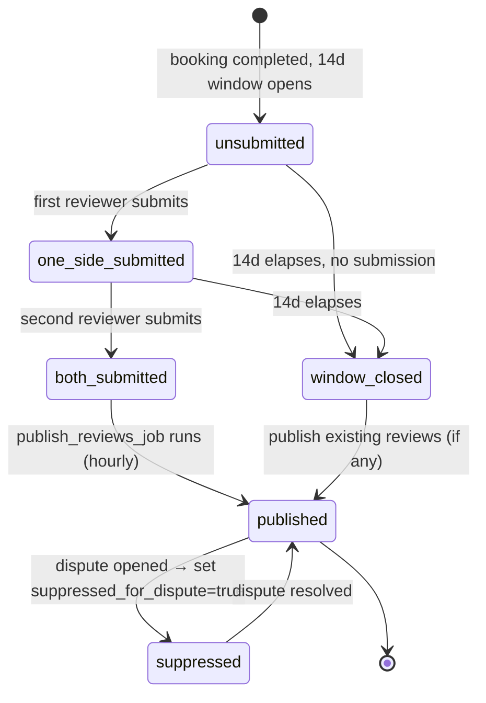
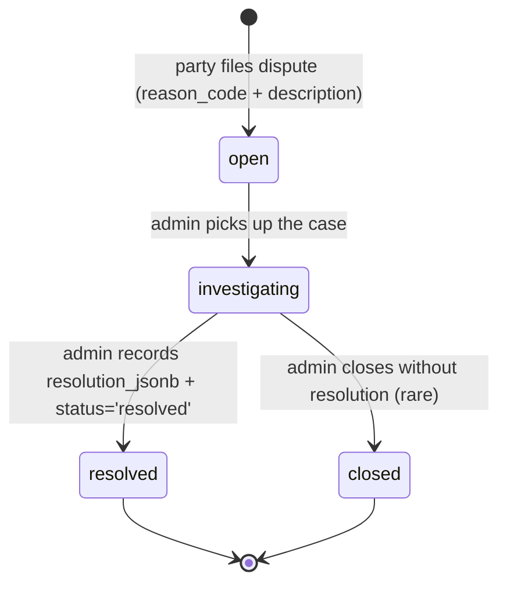

# Sevent — Core state machines

Source of truth for booking, review, and dispute flow logic. Both the SQL schema
(`supabase/migrations/*.sql`) and the TypeScript domain layer (`src/lib/domain/*`)
must stay consistent with this document.

## Booking lifecycle

```mermaid
stateDiagram-v2
  [*] --> sent : organizer sends RFQ → supplier receives invite
  sent --> draft_quote : supplier starts a quote
  draft_quote --> sent_quote : supplier sends quote (new quote_revisions row)
  sent_quote --> accepted : organizer accepts quote (soft-hold + awaiting_supplier)
  accepted --> confirmed : supplier confirms within 48h (soft-hold → booked)
  accepted --> cancelled_by_supplier : supplier declines
  accepted --> cancelled_by_system : 48h confirm_deadline elapses (pg_cron)
  confirmed --> completed : service delivered; service_status='completed'
  completed --> disputed : either party files a dispute (within 7d)
  completed --> [*] : 14d review window closes
  disputed --> resolved : admin resolves; reviews re-evaluated
  resolved --> [*]
```

### Soft-hold → booked transition

Organizer acceptance:

```
BEGIN;
  insert into bookings (..., confirmation_status='awaiting_supplier',
                        awaiting_since=now(), confirm_deadline=now()+interval '48 hours',
                        accepted_quote_revision_id=:revId);
  insert into availability_blocks (supplier_id, starts_at, ends_at,
                                   reason='soft_hold', booking_id=:bookingId,
                                   quote_revision_id=:revId,
                                   expires_at=now()+interval '48 hours',
                                   created_by=auth.uid());
  -- Overlap check trigger:
  --   count of rows overlapping (starts_at, ends_at) where reason in
  --   ('soft_hold','booked') < suppliers.concurrent_event_limit;
  --   AND no overlapping row with reason='manual_block'.
  -- If trigger raises, tx aborts and organizer sees a friendly error.
COMMIT;
```

Supplier confirmation:

```
BEGIN;
  -- Re-check overlap (fresh snapshot).
  update availability_blocks
     set reason='booked', expires_at=null, released_at=null
   where id=:holdId and reason='soft_hold';
  update bookings
     set confirmation_status='confirmed', confirmed_at=now()
   where id=:bookingId;
COMMIT;
```

Expiry (pg_cron every 5 min):

```
with stale as (
  select id, booking_id from availability_blocks
   where reason='soft_hold' and expires_at < now()
)
update bookings set confirmation_status='cancelled', cancelled_at=now(),
       cancelled_by=null /* null = system */
 where id in (select booking_id from stale);
delete from availability_blocks
 where id in (select id from stale);
update quotes set status='sent'
 where id in (select q.id from quotes q
              join bookings b on b.quote_id = q.id
              join stale on stale.booking_id = b.id);
```

### Concurrency guarantee

Two organizers accepting the same quote slot simultaneously: exactly one wins.
The GiST index on `availability_blocks(supplier_id, tstzrange(starts_at, ends_at))`
plus the trigger's `count(*)` check inside the same transaction makes the race
serialisable. The losing transaction aborts with a clear message; the UI surfaces
"this date just filled up" and returns to quote inbox.

## Review publication



Publication rule (runs hourly via `pg_cron`):

- If `booking.service_status = 'completed'` AND no dispute with status in
  `('open','investigating')` exists AND (both reviews submitted OR
  `window_closes_at < now()`), set `reviews.published_at = now()`.
- On dispute open: `update reviews set suppressed_for_dispute = true
  where booking_id = :id` and clear `published_at`.
- On dispute resolve: re-evaluate.

## Dispute lifecycle



- Either party (organizer or the supplier's profile owner) may open a dispute on
  a `completed` booking within 7 days of `completed_at`.
- Both sides may submit `dispute_evidence` (files or text notes). Items default
  to `visible_to_other_party=true`; admin may submit internal-only evidence.
- Opening a dispute sets `reviews.suppressed_for_dispute=true` for that booking.
- Resolving flips it back and the hourly review-publish job re-evaluates.

## Actors and inputs

| Event | Actor | Required inputs | DB writes |
|---|---|---|---|
| Send RFQ | organizer | event_id, category, subcategory, supplier shortlist | rfqs (status=sent), rfq_invites |
| Submit quote | supplier | line items OR free-form payload | quotes, quote_revisions (new version, content_hash) |
| Accept quote | organizer | quote_id | bookings (awaiting_supplier), availability_blocks (soft_hold), quotes.status=accepted |
| Confirm booking | supplier | booking_id | availability_blocks.reason=booked, bookings.confirmation_status=confirmed |
| Decline booking | supplier | booking_id, reason | availability_blocks delete, bookings.cancelled, quote.status=sent |
| Complete booking | organizer OR admin (or cron when ends_at passes) | booking_id | bookings.service_status=completed, completed_at |
| Submit review | either party | booking_id, ratings, text | reviews (respecting unique(booking_id, reviewer_id)) |
| Open dispute | either party | booking_id, reason_code, description | disputes (status=open), reviews.suppressed |
| Submit evidence | either party | dispute_id, kind, file_path OR text_note | dispute_evidence |
| Resolve dispute | admin | dispute_id, resolution_jsonb | disputes.status=resolved, reviews.suppressed=false |
